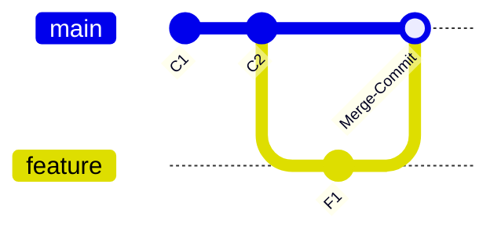
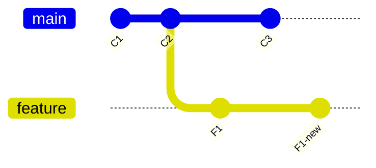
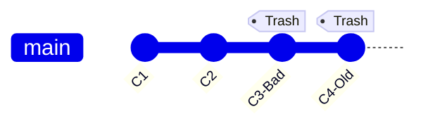
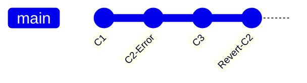

# Hướng dẫn chi tiết: Git Merge, Rebase, Reset & Revert (Minh họa)

Chào bạn! Đây là bản tổng hợp đầy đủ nhất bao gồm cả các lệnh "Undo" (Hủy bỏ thay đổi) cực kỳ quan trọng là Reset và Revert kèm sơ đồ minh họa.

---

## 1. Git Merge (Hợp nhất)
Gộp lịch sử của hai nhánh bằng cách tạo một "Merge Commit".

## 2. Git Rebase (Tái định cơ sở)
Viết lại lịch sử bằng cách chuyển các commit nhánh con lên đỉnh nhánh chính.

---

## 3. Git Reset (Quay lại quá khứ)
Lệnh này dùng để **"di chuyển ngược"** con trỏ của nhánh hiện tại về một commit cũ.

### Các chế độ Reset:
1.  **--soft**: Giữ nguyên mọi thay đổi ở khu vực Staging (chờ commit).
2.  **--mixed (Mặc định)**: Giữ thay đổi nhưng đưa về thư mục làm việc (Working Directory).
3.  **--hard**: **XÓA SẠCH** mọi thay đổi, đưa toàn bộ code về trạng thái của commit đó.

### Minh họa Reset:
*Trong sơ đồ bên dưới, sau khi thực hiện reset về C2, các commit C3 và C4 sẽ không còn nằm trong lịch sử chính.*

---

## 4. Git Revert (Đảo ngược thay đổi)
Khác với Reset, Revert không xóa commit cũ. Nó tạo ra một **commit mới** có nội dung ngược hoàn toàn với commit bạn muốn bỏ.

### Minh họa Revert:

---

## 5. Khi nào nên dùng lệnh nào?

| Tình huống | Lệnh khuyên dùng | Tại sao? |
| :--- | :--- | :--- |
| Bạn lỡ tay commit lỗi nhưng **chưa push** | `git reset --soft` | Để sửa lại code và commit lại cho sạch. |
| Code lỗi đã **push lên server** chung | `git revert` | Để mọi người cùng thấy lịch sử đảo ngược, tránh xung đột. |
| Muốn xóa sạch các thay đổi nháp để làm lại | `git reset --hard` | Dọn dẹp nhanh nhưng hãy cẩn thận! |
| Muốn gộp code sạch sẽ trước khi tạo PR | `git rebase` | Giúp reviewer dễ đọc lịch sử tuyến tính. |

---
*Tài liệu được trích xuất từ Brain của Antigravity AI*
